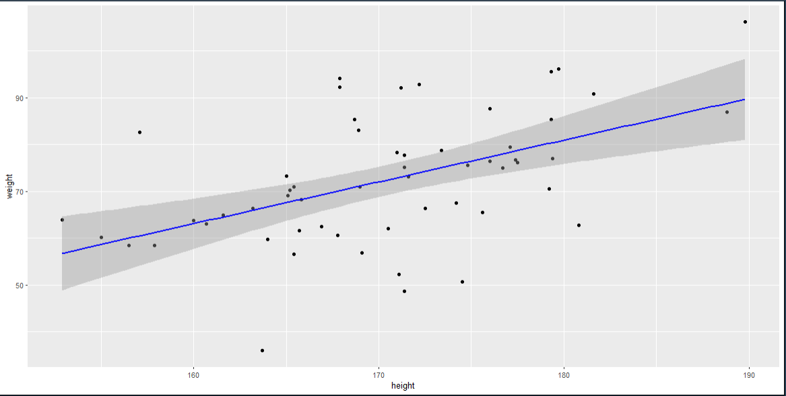
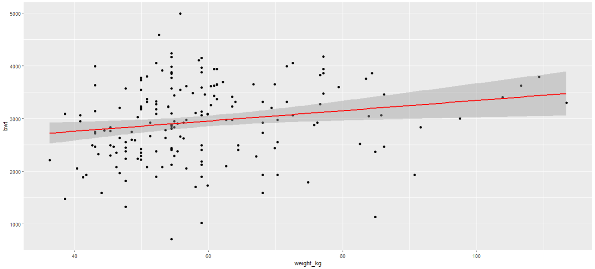

# Linear Regression Analysis Project

This markdown file summarizes a full workflow of linear regression analyses conducted in R. It includes data loading, descriptive plots, model fitting, confounder adjustment, interpretation of coefficients, confidence intervals, and manual formula-based calculations.

---

## 1. Loading Dataset and Preparing Environment

```r
getwd()
setwd("C:/Users/USER/Documents")

# Load the health dataset
d_health <- read.table("example_dataset.txt", header = TRUE, sep = "\t")
```

---

## 2. Scatterplot: Height vs Weight

```r
library(ggplot2)

scatterplot1 <- ggplot(d_health, aes(x = height, y = weight)) +
  geom_point() +
  geom_smooth(method = "lm", se = TRUE, color = "blue")

scatterplot1

```

Add plot:


---

## 3. Linear Regression Model 1 — Unadjusted

### Model: `weight ~ height`

```r
m1 <- lm(weight ~ height, data = d_health)
summary(m1)
```

### Regression Equation

[
weight= −79.8 + 0.89×height
]

Using standard regression notation:

$$\hat{Y}=\beta_0+\beta_1 X$$

Estimated model:
$$\hat{Y}=-79.8+0.89\*X$$

Parameters:
- \(\beta_0=-79.8\) (intercept)
- \(\beta_1=0.89\) (slope)

### Interpretation

* A **1 cm increase in height** corresponds to a **0.89 kg increase in weight**.
* 95% CI for height coefficient: **0.48 to 1.31**.
* Strong evidence of association (p = **6.4e-05**).

---

## 4. Confidence Interval Calculation (Manual)

```r
beta1 <- coef(summary(m1))["height", "Estimate"]
se_beta1 <- coef(summary(m1))["height", "Std. Error"]

beta1 - 1.96 * se_beta1
beta1 + 1.96 * se_beta1
```

Matches `confint(m1)`.

---

## 5. Model 2 — Adjusting for Confounding

### Model: `weight ~ height + factor(sex)`

```r
m2 <- lm(weight ~ height + factor(sex), data = d_health)
summary(m2)
```

### Regression Equation

Using standard regression notation:

$$\hat{Y}=\beta_0+\beta_1 X+\beta_2 D$$

Estimated model:
$$\widehat{\text{weight}}=9.66+0.41\*\text{height}-11.1\*\text{sex(Female)}$$

Parameters:
- \(\beta_0=9.66\) (intercept)
- \(\beta_1=0.41\) (height)
- \(\beta_2=-11.1\) (sex: Female vs reference)

Interpretation:
* A 1 cm increase in height is associated with a 0.41 kg increase in weight, holding sex constant.
* Being female is associated with a 11.1 kg lower weight versus the reference category, holding height constant.

### Interpretation

* Adjusted effect: **0.41 kg per 1 cm height**, p = **0.15**.
* CI (height): **-0.15 to 0.96** → includes 0 → weaker evidence.

---

## 6. Second Example — Weight Predicting Systolic BP

### Model: `BPsystolic ~ weight`

```r
m3 <- lm(BPsystolic ~ weight, data = d_health)
summary(m3)
```

### Regression Equation

[
BPsystolic = 81.96 + 0.60 * weight
]

Parameters:
- \(\beta_0 = 81.96\) (intercept)
- \(\beta_1 = 0.60\) (slope; mmHg per 1 kg)

### Interpretation

* Each **1 kg increase in weight increases SBP by 0.60 mmHg**.
* 95% CI: **0.35–0.85**, p = **1.15e-05**.

---

## 7. Adjusted Blood Pressure Model

### Model: `BP ~ weight + sex + smoking + education`

```r
m4 <- lm(BPsystolic ~ weight + factor(sex) + factor(smoking) + factor(education), data = d_health)
summary(m4)
```

### Regression Equation

[
SBP = 109.7 + 0.40 * weight - 9.64 * sex(F) - 9.60 * smoke(Former) - 8.48 * smoke(Never) + 
8.31 * edu(LowerSec) - 2.32 * edu(UpperSec)
]

### Interpretation

* Adjusted effect: **0.40 mmHg per 1 kg weight**, p = **0.0071**.
* CI: **0.11–0.68**, strong evidence.

---

## 8. Birthweight Analysis (Exercise 4)

Dataset: `birthweight_dataset.txt`

```r
d_birth <- read.table("birthweight_dataset.txt", header=TRUE, sep="\t")
d_birth$weight_kg <- d_birth$lwt * 0.4536
```

### Scatterplot

```r
library(ggplot2)

scatterplot2 <- ggplot(d_birth, aes(x = weight_kg, y = bwt)) +
  geom_point() +
  geom_smooth(method = "lm", se = TRUE, color = "red")

scatterplot2

```



---

## 9. Birthweight Model — Unadjusted

### Model: `bwt ~ weight_kg`

Regression equation:
bwt = 2369.6 + 9.76 * weight_kg


* CI: **2.31–17.22**
* p = **0.0105**

---

## 10. Birthweight Model — Adjusted

Confounders selected:

* **Age** ✔️
* **Race** (proxy for structural inequality) ✔️
* **Hypertension** ✔️
* Smoking excluded for this example

### Model

```r
model_adjusted <- lm(bwt ~ weight_kg + age + factor(race) + factor(ht), data = d_birth)
summary(model_adjusted)
```

### Regression Equation


bwt = 2374.19 + 12.64 * weight_kg + 0.03 *age -432 * race(Black) -224 * race(Other) -558 * ht(Yes)


### Interpretation

* Adjusted effect: **12.64 g per 1 kg maternal weight**, p = **0.0018**.
* 95% CI: **4.76–20.51 g**.

---

## 11. Manual Formula Verification (β0, β1, R², σ²)

Example for `m1`:

```r
n <- nrow(d_health)
mean_height <- mean(d_health$height)
mean_weight <- mean(d_health$weight)
ss_height <- sum((d_health$height - mean_height)^2)
ss_weight_height <- sum((d_health$weight - mean_weight) * (d_health$height - mean_height))

beta1_formula <- ss_weight_height / ss_height
beta0_formula <- mean_weight - beta1_formula * mean_height

ss_total <- sum((d_health$weight - mean_weight)^2)
ss_residual <- sum(resid(m1)^2)
r2_formula <- 1 - (ss_residual / ss_total)
sigma2_formula <- ss_residual / (n - 2)
```

All results match the values printed by `summary(m1)`.

---

## 12. Final Summary Table

| Model                                      | Beta  | 95% CI     | p-value |
| ------------------------------------------ | ----- | ---------- | ------- |
| Height → Weight (Unadjusted)               | 0.89  | 0.48–1.31  | 6.4e-05 |
| Height → Weight (Adjusted)                 | 0.41  | -0.15–0.96 | 0.15    |
| Weight → SBP (Unadjusted)                  | 0.60  | 0.35–0.85  | 1.1e-05 |
| Weight → SBP (Adjusted)                    | 0.40  | 0.11–0.68  | 0.0071  |
| Maternal Weight → Birthweight (Unadjusted) | 9.76  | 2.31–17.22 | 0.0105  |
| Maternal Weight → Birthweight (Adjusted)   | 12.64 | 4.76–20.51 | 0.0018  |

---

## 13. Conclusion

This project illustrates:

* How to fit linear models in R
* How to interpret regression coefficients
* Usage of confidence intervals and p-values
* How adjustment for confounding changes estimates
* Verification of regression formulas manually

It can be used as a complete reproducible example for teaching or portfolio purposes.

---
✍️ Prepared by: Edeko Eromosele Ethan
